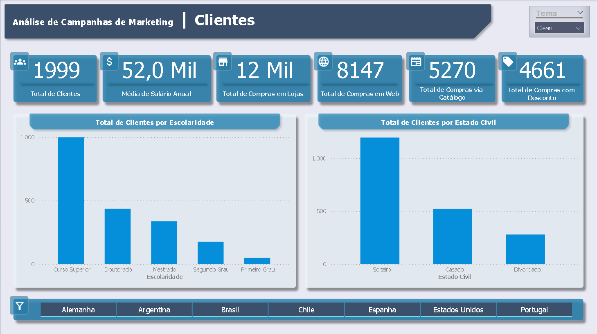
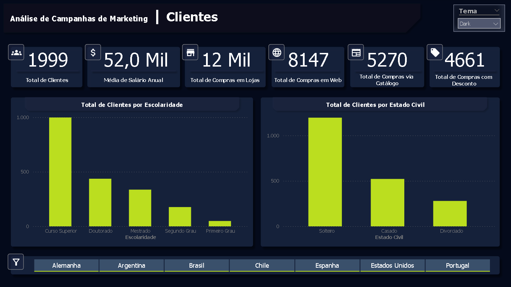
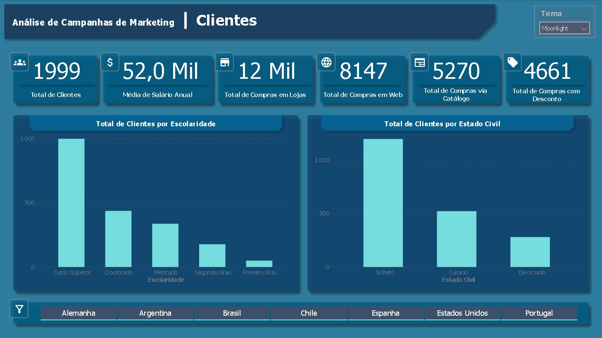
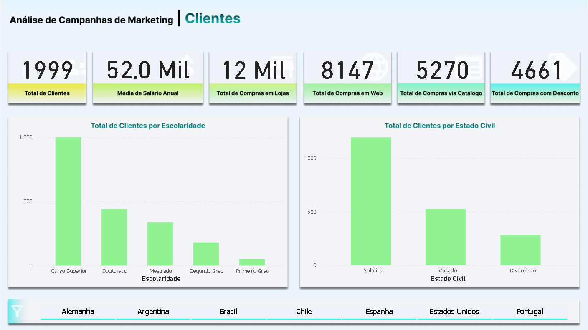
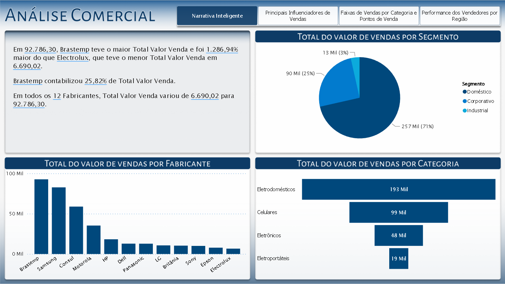

# Projetos:

## Dados: Dashboards com Power BI

1. [Visão_Geral-Vendas_Custo_Lucro_KPI(Tema_Escuro)](https://app.powerbi.com/view?r=eyJrIjoiMDYyOWJmMWYtYmQ2MS00Y2ZjLTgwZjQtM2YzNDZhYzljYzEwIiwidCI6ImQzODEyYzgxLWQ0ZmUtNDQxOS04NzU3LTA0ODM1MTFhYmQ0MiJ9)

    

2. [Visão_Geral-Vendas_Custo_Lucro_KPI(Tema_Claro)](https://app.powerbi.com/view?r=eyJrIjoiODBiMGIyYjMtOWYwZC00MjdjLTgxN2UtODAxODBkZjhhNDNjIiwidCI6ImQzODEyYzgxLWQ0ZmUtNDQxOS04NzU3LTA0ODM1MTFhYmQ0MiJ9)

    

3. [Dashboard_Analitico-Vendas_Globais(Tema_Escuro)](https://app.powerbi.com/view?r=eyJrIjoiNjY0OWE4YTUtYTlhZi00MjBlLTgzOTAtMDM2NzQ2MTA2NDA3IiwidCI6ImQzODEyYzgxLWQ0ZmUtNDQxOS04NzU3LTA0ODM1MTFhYmQ0MiJ9)

    

4. [Dashboard_Analitico-Vendas_Globais(Tema_Claro)](https://app.powerbi.com/view?r=eyJrIjoiZDQ3ODkwNmYtZTQ3Zi00MzU4LTkyNDEtM2IyZTEyY2MyMmIzIiwidCI6ImQzODEyYzgxLWQ0ZmUtNDQxOS04NzU3LTA0ODM1MTFhYmQ0MiJ9)

    

5. [Análise_de_Campanhas_de_Marketing(3_Temas)](https://app.powerbi.com/view?r=eyJrIjoiM2YzNGE1YjctYWI2Ni00ZmI1LWI3ZDctZGZmYzdkZDAyZmRiIiwidCI6ImQzODEyYzgxLWQ0ZmUtNDQxOS04NzU3LTA0ODM1MTFhYmQ0MiJ9&pageName=ReportSection)
Tema: Clean

    

Tema: Dark

    

Tema: Moonlight

    

6. Análise_de_Campanhas_de_Marketing(Tema_Claro)

    

7. Análise_de_Dados_Comerciais

    

8. Análise_de_Dados_RH

    

-------------------------------------------- 

Por: Bianca Camargo 
